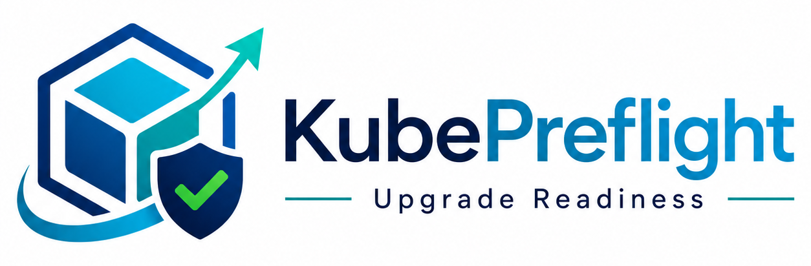

<p align="center">
  
</p>

# KubePreflight

<p align="center">
  <a href="https://go.dev/"></a>
  <a href="https://kubernetes.io/"></a>
  <a href="https://aws.amazon.com/eks/"></a>
  
  
  <a href="./LICENSE"></a>
</p>

**KubePreflight is a Kubernetes upgrade-readiness CLI and Console for SRE and platform teams.**
It scans a cluster before a Kubernetes or EKS upgrade and reports exactly what will break —
removed/deprecated APIs, fail-closed admission webhooks, PDB drain blockers, unhealthy
workloads, node/kubelet skew, and EKS add-on or upgrade-insight risk — evidence-backed,
prioritized, and read-only.

## Who this is for

- **SRE teams** planning and gating a Kubernetes or EKS version bump
- **Platform engineering teams** who own upgrade policy across many clusters
- **DevOps engineers** who need a go/no-go signal before opening a change window
- **Kubernetes/EKS cluster owners** who want evidence, not guesses, about what an upgrade will break
- **CI/CD and GitOps teams** who want an exit-code gate they can drop into a pipeline

## Problem

Kubernetes and EKS upgrades fail or get delayed because teams discover removed
APIs, PDB drain blockers, fail-closed admission webhooks, unhealthy workloads,
node/kubelet skew, or EKS add-on incompatibilities too late — usually mid-upgrade,
inside the change window. Existing tools each cover one slice of this (deprecated
APIs, or cluster hygiene, or native EKS Upgrade Insights); none correlate evidence
across manifests, live cluster state, and AWS APIs into one prioritized readiness
report.

## What it does

KubePreflight answers one question before you touch the change window: **will this
upgrade break production?** It correlates deprecated-API usage, admission webhooks,
PodDisruptionBudgets, EKS add-ons, node/kubelet skew, and AWS provider signals into
a single go/no-go readiness report with sequenced remediation.

KubePreflight is **CLI-first**: the read-only CLI is the readiness engine, and the
optional local Console reads `findings.json` for review and evidence exploration.
Hosted SaaS/fleet mode remains deferred until pilot validation.

## Install

The fastest way to get started is a prebuilt binary from
[the latest release](https://github.com/imneeteeshyadav98/kubepreflight/releases/latest)
— no Go toolchain, no build step.

### Linux (amd64)

```bash
VERSION=v0.4.2

curl -LO "https://github.com/imneeteeshyadav98/kubepreflight/releases/download/${VERSION}/kubepreflight_${VERSION}_linux_amd64.tar.gz"
curl -LO "https://github.com/imneeteeshyadav98/kubepreflight/releases/download/${VERSION}/kubepreflight_${VERSION}_checksums.txt"

grep "kubepreflight_${VERSION}_linux_amd64.tar.gz" "kubepreflight_${VERSION}_checksums.txt" | sha256sum -c -

tar -xzf "kubepreflight_${VERSION}_linux_amd64.tar.gz"
sudo install -m 0755 "kubepreflight_${VERSION}_linux_amd64/kubepreflight" /usr/local/bin/kubepreflight

kubepreflight --help
```

Each archive extracts into its own directory (`kubepreflight_<version>_<os>_<arch>/`, containing the binary alongside `README.md`/`LICENSE`) rather than a bare binary — the path above accounts for that.

### Linux (arm64)

Same steps as above, substituting `kubepreflight_${VERSION}_linux_arm64.tar.gz` and the matching extracted directory name.

### macOS (Apple Silicon)

```bash
VERSION=v0.4.2

curl -LO "https://github.com/imneeteeshyadav98/kubepreflight/releases/download/${VERSION}/kubepreflight_${VERSION}_darwin_arm64.tar.gz"
curl -LO "https://github.com/imneeteeshyadav98/kubepreflight/releases/download/${VERSION}/kubepreflight_${VERSION}_checksums.txt"

grep "kubepreflight_${VERSION}_darwin_arm64.tar.gz" "kubepreflight_${VERSION}_checksums.txt" | shasum -a 256 -c -

tar -xzf "kubepreflight_${VERSION}_darwin_arm64.tar.gz"
sudo install -m 0755 "kubepreflight_${VERSION}_darwin_arm64/kubepreflight" /usr/local/bin/kubepreflight

kubepreflight --help
```

### macOS (Intel)

Same steps as above, substituting `kubepreflight_${VERSION}_darwin_amd64.tar.gz` and the matching extracted directory name.

> **Gatekeeper note:** if macOS refuses to run the binary ("cannot be opened
> because the developer cannot be verified"), clear the quarantine attribute
> rather than disabling Gatekeeper system-wide:
> ```bash
> xattr -d com.apple.quarantine /usr/local/bin/kubepreflight
> ```

### Windows (amd64)

```powershell
$VERSION = "v0.4.2"
Invoke-WebRequest -Uri "https://github.com/imneeteeshyadav98/kubepreflight/releases/download/$VERSION/kubepreflight_${VERSION}_windows_amd64.zip" -OutFile "kubepreflight.zip"
Expand-Archive -Path "kubepreflight.zip" -DestinationPath "."
.\kubepreflight_${VERSION}_windows_amd64\kubepreflight.exe --help
```

The zip extracts into its own folder (`kubepreflight_<version>_windows_amd64\`,
alongside `README.md`/`LICENSE`) rather than a bare `.exe`. Move
`kubepreflight_<version>_windows_amd64\kubepreflight.exe` into a directory
already on your `PATH` (or add that folder to `PATH`) to run it as
`kubepreflight` from any shell.

### Verify a download

Every release publishes `kubepreflight_<version>_checksums.txt` (SHA-256, GNU
coreutils format) and an SPDX SBOM, `kubepreflight_<version>_sbom.spdx.json`.
If you downloaded every asset into one folder, verify all of them at once:

```bash
sha256sum -c kubepreflight_v0.4.2_checksums.txt      # Linux
shasum -a 256 -c kubepreflight_v0.4.2_checksums.txt  # macOS
```

Windows PowerShell has no built-in batch-verify equivalent to `-c`; compute a
single file's hash and compare it by eye against the matching line in
`kubepreflight_v0.4.2_checksums.txt`:

```powershell
Get-FileHash .\kubepreflight_v0.4.2_windows_amd64.zip -Algorithm SHA256
```

### Docker

```bash
docker pull ghcr.io/imneeteeshyadav98/kubepreflight:0.4.2
docker run --rm ghcr.io/imneeteeshyadav98/kubepreflight:0.4.2 --help
```

The image is [distroless](https://github.com/GoogleContainerTools/distroless)
and runs as a fixed non-root user, so a plain bind mount for output usually
fails with a permission error unless you match the container's user to your
own — this is why every real example below passes `--user`:

```bash
# Manifest-only scan: no cluster, no kubeconfig, only a mounted directory
docker run --rm --user "$(id -u):$(id -g)" \
  -v "$(pwd)/k8s:/work/k8s:ro" \
  -v "$(pwd)/out:/work/out" \
  ghcr.io/imneeteeshyadav98/kubepreflight:0.4.2 \
  scan --manifests-only --manifests /work/k8s --target-version 1.36 \
  --output-dir /work/out --serve-report never
```

For a live-cluster scan, also mount a kubeconfig read-only and point
`--kubeconfig` at its in-container path — `docker-compose.yml` in this repo
does exactly that (mounts `~/.kube` read-only, matches your host UID/GID via
`user:`, writes `findings.json` to `./out`):

```bash
docker compose up
```

`docker-compose.yml` sets `network_mode: host`, needed on Linux because kind
(and most local clusters) bind their API server to `127.0.0.1` on the host,
unreachable from inside a container without host networking — **this is
Linux-only**. Docker Desktop on macOS/Windows runs containers inside a VM
where host networking doesn't give the same access to a locally-running kind
cluster; on those platforms run KubePreflight natively against a local kind
cluster instead. A real EKS/GKE/AKS cluster has a routable endpoint, not
`127.0.0.1`, so this caveat only applies to local kind-style clusters.

The distroless image also has no `helm` binary, so render charts on the host
(`helm template`) and mount the rendered YAML — see
[Quick start](#quick-start) below.

Building from source instead of using a release binary or the published
image:

```bash
git clone https://github.com/imneeteeshyadav98/kubepreflight.git
cd kubepreflight && go build -o kubepreflight ./cmd/kubepreflight
```

## Current capabilities

| Capability | What it means |
|---|---|
| Read-only cluster scan | Cluster-only by default, or with `--provider=eks` for AWS enrichment |
| Multi-format reports | JSON, Markdown, and self-contained HTML, plus a compact terminal summary |
| Embedded Console | Local React app embedded in the binary — no Node, no browser account — split-pane findings workspace with filters and evidence/remediation detail |
| Local report server | Serves `report.html`, `findings.json`, and the Console together on `127.0.0.1` |
| Evidence-backed findings | Every finding carries raw evidence, a confidence tier, and a specific remediation — never just a rule name |
| AWS/EKS enrichment | EKS Upgrade Insights, add-on compatibility, and subnet/VPC checks with `--provider=eks` — degrades gracefully without it |
| Validated on real EKS | Run end-to-end against a real, throwaway EKS cluster, both clean and seeded worst-case — see [Validated on real EKS](#validated-on-real-eks) |
| Upgrade Priority (P1–P4) | Every finding is assigned a priority — what to fix first — independent of Severity and Confidence — see [Priority (P1–P4)](#priority-p1p4) |
| Multi-hop upgrade planner | `kubepreflight plan` sequences a hop-by-hop readiness view, plus an optional action-plan checklist — see [Multi-hop upgrade planner](#multi-hop-upgrade-planner) |
| Upgrade Readiness scorecard | A 0–100 readiness score plus a Passed/Warning/Failed rollup across all 9 rule-family categories (API Compatibility, Extension APIs, Admission Webhooks, Disruption Safety, Node Readiness, Add-ons, CoreDNS, Workload Health, EKS Upgrade Insights) — the numeric score is always kept separate from the hard blocker verdict, in every format including the Console, where each category's rule IDs are clickable chips that jump straight to the filtered finding |
| No-upgrade-required framing | When the cluster's current version and `--target-version` are the same release, KubePreflight never says "Upgrade Ready" — it says "No upgrade required" instead, and every renderer (terminal, Markdown, HTML, Console) relabels the scorecard as "Cluster Health" with a "Remediation needed" column in place of "Upgrade continue". Current-state and manifest-safety findings are still fully evaluated and reported — only the upgrade-transition framing is skipped |
| Manifest-only scanning | `--manifests-only` skips kubeconfig loading and all cluster/AWS collection entirely — no cluster credentials needed to catch removed/deprecated APIs in raw or Helm-rendered YAML — see [Quick start](#quick-start) |
| GitHub Action | Composite action wrapping the same read-only `scan`, with a Step Summary scorecard, workflow-artifact reports, and a configurable Blocker/Warning exit policy — see [GitHub Action](#github-action) |
| Scan comparison | `kubepreflight compare` diffs two `findings.json` scans by fingerprint — new/resolved/changed/unchanged findings, verdict movement, and readiness-score delta — turning repeated scans into a remediation-progress tracker, not just a one-time snapshot — see [Scan comparison](#scan-comparison) |

The example below is from a real scan against a local kind cluster seeded with the original MVP failure modes (see [`demo/`](./demo)) — run it yourself and you'll get this exact shape of output.

```text
KubePreflight scan — cluster: kind-kubepreflight-demo  target: 1.34  provider: cluster-only
Result: BLOCKED

Upgrade Readiness: BLOCKED — Score: 16/100 — Upgrade Continue: No
  API Compatibility: Failed (5 blocker(s), 0 warning(s))
  Extension APIs: Passed (0 blocker(s), 0 warning(s))
  Admission Webhooks: Failed (1 blocker(s), 1 warning(s))
  Disruption Safety: Failed (3 blocker(s), 0 warning(s))
  Node Readiness: Failed (2 blocker(s), 1 warning(s))
  Add-ons: Passed (0 blocker(s), 0 warning(s))
  CoreDNS: Warning (0 blocker(s), 1 warning(s))
  Workload Health: Passed (0 blocker(s), 0 warning(s))
  EKS Upgrade Insights: Passed (0 blocker(s), 0 warning(s))

API Compatibility: Failed — Upgrade Continue: No — Score Impact: -60
  Removed API objects: 5 across 3 API families
  Deprecated API objects: 0 across 0 API families
  Critical impact: Yes

Blockers (11)
  [P2/API-001] PodDisruptionBudget "demo/shared-app-pdb-a" (apiVersion policy/v1beta1) still exists
  at a version removed in Kubernetes 1.25 — target version 1.34 will no longer serve this API...
    Priority P2 (do not attempt other remediation until this is fixed): Resource or behavior may
    fail after the target Kubernetes upgrade.
  (also fires for shared-app-pdb-b, singleton-app-pdb, and PodSecurityPolicy demo-restricted)

  [P3/NODE-001] Node "kubepreflight-demo-control-plane": kubelet version v1.24.15 is outside the
  supported skew window for target version 1.34 — 10 minor versions behind, exceeds n-3 policy

  [P3/PDB-001] PodDisruptionBudget demo/singleton-app-pdb: disruptionsAllowed=0 (minAvailable: 1,
  currentHealthy=1, desiredHealthy=1, expectedPods=1) — healthy matching pods cannot currently be
  voluntarily evicted, so a node drain or node upgrade can stall or fail
  (also fires for shared-app-pdb-b)

  [P3/PDB-002] PodDisruptionBudgets demo/shared-app-pdb-a and demo/shared-app-pdb-b select an
  overlapping set of pods (2 overlapping pods) — the Eviction API rejects eviction when multiple
  PDBs match the same pod...

  [P4/WH-002] ValidatingWebhookConfiguration "demo-catchall-guard": fail-closed, zero ready
  endpoints — matching API writes will be rejected

Warnings (3)
  [P4/COREDNS-001] CoreDNS Corefile is missing the `ready` plugin...
  [P4/WH-001] ValidatingWebhookConfiguration "demo-catchall-guard": catch-all scope...

Info (23)
  23 findings that need no action right now — kube-apiserver-managed FlowSchema/
  PriorityLevelConfiguration defaults and controller-managed EndpointSlices.

Next Actions (9)
  1. [P2/Blocker] PodSecurityPolicy/demo-restricted (API-001)
  ...
  7. [P4/Blocker] ValidatingWebhookConfiguration/demo-catchall-guard (WH-001, WH-002)
     ...    Also see WH-001: Inspect the webhook's current rules and selectors: ...

Summary: 11 blocker(s), 3 warning(s), 23 info(s)
Reports written: findings.json · report.md · report.html
```

WH-001 and WH-002 fired on the *same* webhook (broad scope + a dead backend), but Next Actions merges them into one item instead of two separate, potentially contradictory instructions — the Blockers section above still lists both separately, since that's correlation evidence worth keeping.

A few things worth knowing about the counts above, all covered in full in [Known limitations](#known-limitations): the 23 Info findings are kube-apiserver-owned `FlowSchema`/`PriorityLevelConfiguration` defaults and controller-managed `EndpointSlice` objects — neither is something a person migrates by hand, so they're visible for inventory but don't gate the exit code. One `EndpointSlice` (`default/kubernetes`) still reports as a real Blocker — a disclosed, narrow exception where KubePreflight can't yet confirm it's safe to downgrade. Live `Event` objects are excluded from scanning entirely (not shown above at all) for the same reason.

### Demo output isn't committed

`demo/sample-output/` used to be a captured, committed example — it went stale repeatedly as the product evolved, and a real scan's finding count moves with the product (new checks, catalog entries, and rule behavior all change it), so a frozen snapshot couldn't stay accurate. Run the block above yourself (see [`demo/README.md`](./demo/README.md)) for real, current output. Nothing in this repo's own tests depends on a committed capture staying accurate either — `web/tests/browser_smoke.py` drives the Console against a small fixture generated fresh from `internal/report` on every run (see [CI / dev verification](#ci--dev-verification)), not demo output.

---

## What it checks

31 checks today:

| ID | Check | Data source | Severity | Confidence |
|---|---|---|---|---|
| API-001 | Removed APIs vs target version | Live objects + raw/rendered manifests | Blocker | `STATIC_CERTAIN` |
| API-002 | Deprecated APIs still served at target version | Live objects + raw/rendered manifests | Warning | `STATIC_CERTAIN` |
| WH-001 | Broad/catch-all fail-closed webhooks | ValidatingWebhookConfiguration | Warning | `STATIC_CERTAIN` |
| WH-002 | Webhook backend unavailable or misconfigured: missing/invalid clientConfig, referenced Service missing, invalid port, or zero ready endpoints | Webhook config + Service + EndpointSlice | Blocker for `failurePolicy: Fail`; Warning for `failurePolicy: Ignore` (writes aren't rejected, but admission control silently doesn't apply) | `STATIC_CERTAIN` for static config checks, `OBSERVED` for the live endpoint-health check |
| WH-004 | Webhook TLS/CA safety: empty/invalid/unparseable `caBundle`, expired or soon-to-expire CA certificate, certificate not marked as a CA, insecure (non-`https://`) webhook URL | Webhook clientConfig (`caBundle`, `url`) | Blocker for `failurePolicy: Fail`; Warning for `failurePolicy: Ignore` on the "currently broken" cases (empty/invalid caBundle, expired cert, insecure URL); always Warning for forward-looking signals (cert expiring soon, cert not marked as CA) | `STATIC_CERTAIN` |
| WH-005 | Webhook unsafe scope and timeout: `timeoutSeconds` near the 30s API ceiling, `operations: ["*"]` (includes CONNECT), self-interception (rules cover the webhook config resources themselves), or fail-closed coverage of cluster-critical resources (nodes, namespaces, persistentvolumes) | Webhook rules, selectors, timeoutSeconds | Warning for general scope risk (excessive timeout, wildcard operations) regardless of failurePolicy; Blocker for `failurePolicy: Fail` self-interception or high-risk-resource coverage, Warning for `failurePolicy: Ignore` | `STATIC_CERTAIN` |
| PDB-001 | Fresh `disruptionsAllowed=0` with selected pods | PodDisruptionBudget status | Blocker | `OBSERVED` |
| PDB-002 | Overlapping PDBs (incl. CoreDNS duplicate-PDB case) | PDB selectors vs live pods | Blocker | `OBSERVED` |
| DRAIN-001 | Deployment/StatefulSet with effectively one replica: zero available capacity during eviction, regardless of PDB presence | Deployment/StatefulSet spec + status + PDB relationship (evidence only) | Warning | `STATIC_CERTAIN` |
| DRAIN-002 | Deployment/StatefulSet pod using `hostPath` or a PersistentVolumeClaim bound to a node-pinned PersistentVolume (Local source, or exact single-hostname `nodeAffinity`) | Pod template volumes + PVC/PV binding + Node readiness | Warning; Blocker only when the pinned node is currently NotReady and the workload is a singleton | `OBSERVED` |
| DRAIN-003 | Hard scheduling constraint that a replacement pod may not survive: node affinity/selector satisfied by <= 1 node, hostname-topology anti-affinity with no spare node, `topologySpreadConstraints` (`DoNotSchedule`) collapsed to one domain, or a `hostPort` with no free alternate node | Pod template constraints + live Node labels/taints + live Pod placement | Warning | `OBSERVED` |
| DRAIN-004 | Estimated node-capacity shortage: if one node is removed, its non-DaemonSet pods' resource requests (plus any pending pods) exceed the other nodes' estimated spare CPU/memory | Node allocatable + live Pod resource requests | Warning (never Blocker -- no reliable signal that a cluster autoscaler is absent) | `INFERRED` |
| DRAIN-005 | StatefulSet/DaemonSet with fewer Ready replicas/pods than desired right now, before any drain adds further disruption | StatefulSet/DaemonSet status | Warning; Blocker only when zero replicas/pods are Ready (a proven, current fact); `CriticalInfra` escalation for well-known critical node agents (CNI, kube-proxy, CoreDNS, etc.) | `OBSERVED` |
| ADDON-001 | Add-on incompatible with target version | `eks:DescribeAddonVersions` | Blocker | `PROVIDER_REPORTED` |
| ADDON-002 | High-impact add-on compatibility could not be verified (VPC CNI, kube-proxy, CoreDNS, EBS/EFS CSI, metrics-server, ingress controllers, cert-manager, external-dns) | `eks:DescribeAddonVersions` / live workload inventory | Warning | `PROVIDER_REPORTED`/`OBSERVED` |
| EKS-NG-001 | EKS managed node group health issues | `eks:ListNodegroups`/`DescribeNodegroup` | Warning | `PROVIDER_REPORTED` |
| EKS-NG-002 | EKS managed node group limited update headroom | `eks:ListNodegroups`/`DescribeNodegroup` | Warning | `PROVIDER_REPORTED` |
| EKS-NG-003 | EKS managed node group launch template/custom AMI review | `eks:ListNodegroups`/`DescribeNodegroup` | Info | `PROVIDER_REPORTED` |
| EKS-NG-004 | EKS managed node group version context | `eks:ListNodegroups`/`DescribeNodegroup` | Info | `PROVIDER_REPORTED` |
| EKS-INSIGHT-001 | EKS Upgrade Insight reports ERROR | `eks:ListInsights`/`DescribeInsight` | Warning | `PROVIDER_REPORTED` |
| EKS-INSIGHT-002 | EKS Upgrade Insight reports WARNING | `eks:ListInsights`/`DescribeInsight` | Warning | `PROVIDER_REPORTED` |
| EKS-INSIGHT-003 | EKS Upgrade Insight status UNKNOWN | `eks:ListInsights`/`DescribeInsight` | Info | `PROVIDER_REPORTED` |
| NODE-001 | kubelet skew outside supported policy | Node status | Blocker | `STATIC_CERTAIN` |
| NODE-002 | Control-plane subnet IP headroom | `ec2:DescribeSubnets` | Blocker | `STATIC_CERTAIN` |
| NODE-003 | Deprecated `node-role.kubernetes.io/master` scheduling label | Live and manifest workload pod templates | Warning; Blocker for critical infrastructure | `STATIC_CERTAIN` |
| NET-002 | Cluster's security group or VPC no longer exists | `ec2:DescribeSecurityGroups`/`DescribeVpcs` | Blocker | `STATIC_CERTAIN` |
| COREDNS-001 | Corefile missing `ready` plugin | ConfigMap (single allowlisted Get) | Warning | `STATIC_CERTAIN` |
| CRD-001 | Legacy or unavailable CRD stored versions need migration | CustomResourceDefinition status | Warning; Blocker if a stored version is no longer served | `STATIC_CERTAIN` |
| CRD-002 | CRD conversion webhook is broken: no ready endpoints, referenced Service missing, incomplete webhook config, or an empty/unsupported `conversionReviewVersions` list | CRD + Service + EndpointSlice | Blocker | `OBSERVED` for the live endpoint-health check, `STATIC_CERTAIN` for static config checks |
| APISERVICE-001 | Aggregated APIService is unavailable | APIService status | Blocker | `OBSERVED` |
| WORKLOAD-001 | Pod already unhealthy before the upgrade (ImagePullBackOff, CrashLoopBackOff, etc.) | Live pod status | Warning | `OBSERVED` |

`NET-002` was added after AWS upgrade troubleshooting guidance surfaced `SecurityGroupNotFound`/`VpcIdNotFound` as common hard failures alongside IP exhaustion. EKS-NG checks cover EKS managed node groups returned by the EKS `ListNodegroups` API only; self-managed node groups are not listed by that AWS API. EKS Upgrade Insights are AWS-native signals surfaced as warning/info findings plus inventory; `ERROR` is not treated as a blocker yet. CRD storage/conversion and aggregated APIService availability extend that same principle to Kubernetes extension APIs.

Every finding carries a confidence tier so a clean local scan is never silently contradicted by a stale provider signal. EKS Upgrade Insight evidence is marked `PROVIDER_REPORTED` and includes freshness/staleness context rather than replacing KubePreflight's local checks.

## Provider support

| Provider | Status |
|---|---|
| cluster-only (no `--provider`) | Current — Kubernetes-plane checks run against any cluster |
| `eks` | Current — validated against a real EKS cluster (see [Validated on real EKS](#validated-on-real-eks)) |
| `aks` | Planned — CLI flags recognized and validated today; enrichment checks not implemented yet |
| `gke` | Planned — CLI flags recognized and validated today; enrichment checks not implemented yet |

See [`docs/provider-roadmap.md`](./docs/provider-roadmap.md) for what each
provider's enrichment checks do (or will do), and which checks are already
portable across all of them.

## Quick start

### Manifest-only scan (no cluster access)

```bash
kubepreflight scan \
  --manifests-only \
  --manifests ./k8s \
  --target-version 1.36
```

`--manifests-only` skips kubeconfig loading and all cluster/AWS collection
entirely — nothing about the runner needs cluster access at all. It only
runs the two checks that read manifest data (`API-001`/`API-002`); every
other category will read "Passed" without actually having been checked,
since it was never evaluated. Good for pull requests, GitOps repositories,
and any CI job that shouldn't need cluster credentials just to catch a
removed/deprecated API before it merges.

Helm charts aren't scanned directly — render first, then point
`--manifests` at either the output directory or a single rendered file:

```bash
helm template my-app ./chart > rendered.yaml
kubepreflight scan --manifests-only --manifests rendered.yaml --target-version 1.36
```

### Scan your current kubeconfig context

```bash
kubectl config current-context
kubectl get nodes

kubepreflight scan --target-version 1.36
```

With no `--kubeconfig` flag, KubePreflight uses the same `KUBECONFIG`/home
loading rules as `kubectl` — whatever `kubectl config current-context`
just showed you is what gets scanned.

### EKS scan

```bash
aws eks update-kubeconfig \
  --name production-eks \
  --region ap-south-1

AWS_REGION=ap-south-1 kubepreflight scan \
  --provider eks \
  --cluster-name production-eks \
  --target-version 1.36
```

`--cluster-name` is required whenever `--provider eks` is set; there's no
separate `--region` flag — AWS enrichment always resolves its region
through the standard AWS SDK credential/region chain (`AWS_REGION` above,
or a shared config/credentials file, or an IAM role). If AWS enrichment
can't complete — missing credentials, insufficient IAM permissions — the
Kubernetes-plane findings are never discarded, but the overall result is
marked `INCOMPLETE` (exit code `3`) rather than silently reported as clean.

### Live cluster plus manifests

```bash
kubepreflight scan \
  --target-version 1.36 \
  --manifests ./k8s
```

Correlates both planes in one report: `API-001`/`API-002` catch removed
APIs in the manifests directory *before* they're ever applied, on top of
everything the live cluster connection already checks (PDBs, webhooks,
node skew, and more). Manifest scanning is additive to a live scan here —
for a scan that needs no cluster connection at all, use `--manifests-only`
above instead.

## GitHub Action

KubePreflight also ships as a GitHub Action — the same read-only `scan`
command, wired into your CI as a job pass/fail decision with a readiness
scorecard in the Step Summary and `findings.json`/`report.html` uploaded as
workflow artifacts. Full reference, the EKS kubeconfig caveat, and every
input/output: [`docs/ci-integration.md`](./docs/ci-integration.md).

```yaml
- uses: imneeteeshyadav98/kubepreflight@v0.4.2
  with:
    target-version: '1.36'
    manifests: './deploy'
    manifests-only: 'true'
```

Exit policy: a `BLOCKED` verdict (Blocker findings) always fails the job;
`INCOMPLETE` and infrastructure failures (no report could be produced at
all) always fail too, since partial evidence must never read as safe;
Warning-only findings pass unless you set `fail-on-warning: 'true'`.

## Usage

```bash
# Cluster-only scan (no AWS setup required)
./kubepreflight scan --target-version 1.36 --serve-report always

# With AWS/EKS enrichment (EKS-INSIGHT, ADDON, EKS-NG, NODE/NET) — opt-in
AWS_PROFILE=<profile> AWS_REGION=<region> ./kubepreflight scan \
  --provider eks \
  --cluster-name <cluster-name> \
  --target-version 1.36 \
  --serve-report always

# Scan raw manifests alongside the required live-cluster scan
./kubepreflight scan \
  --provider eks \
  --cluster-name <cluster-name> \
  --target-version 1.36 \
  --manifests ./k8s \
  --serve-report always

# Limit namespaced findings; cluster-scoped and AWS findings remain included
kubepreflight scan --target-version 1.36 --namespace-allowlist payments,platform

# CI/script mode: canonical JSON file, no local server, no blocking,
# and no human-readable text on stdout — see the note below.
kubepreflight scan \
  --target-version 1.36 \
  --output json \
  --terminal-output silent \
  --findings-out findings.json \
  --serve-report never

jq '.summary' findings.json

# Keep a run's artifacts together
kubepreflight scan --target-version 1.36 --output all --output-dir ./preflight-output
```

`--output json` controls which **report file** gets written (`findings.json`, always written regardless of `--output`) — it does not by itself change what prints to stdout. Stdout is controlled separately by `--terminal-output` (`full` by default): unless you also pass `--terminal-output silent`, stdout still gets the full human-readable report even in JSON mode, which will break a naive `kubepreflight scan --output json | jq .` pipeline. Add `--terminal-output silent` in CI if stdout must stay machine-safe, and read the JSON from the file it's written to.

AWS enrichment degrades gracefully: missing credentials or IAM permissions do not discard Kubernetes findings, but the report is marked `INCOMPLETE` and exits 3 so CI cannot mistake missing provider evidence for readiness. `--cluster-name` is required when `--provider=eks` is explicitly set.

`--findings-out` always writes the canonical JSON report, including when
`--output=md` or `--output=html`; `--output` selects additional human-readable
artifacts. Manifest scanning is additive to a live cluster scan by default —
combine `--manifests`/`--helm-chart` with a normal scan to check both planes
at once. For a scan that needs no cluster connection at all, pass
`--manifests-only` (see [Quick start](#quick-start)): it skips kubeconfig
loading and all cluster/AWS collection, and only runs the two checks that
read manifest data (`API-001`/`API-002`) — every rule that needs live
cluster/AWS state is skipped rather than run unsafely against absent data.

By default, a scan attached to an interactive terminal writes
`findings.json`, `report.md`, and `report.html`, then serves the report and
local Console on a random `127.0.0.1` port until you press Ctrl+C. Redirected
stdout, `CI` environments, and explicit `--output=json` runs do not start or
wait on the server. Use `--serve-report=never` for scripts,
`--serve-report=always` to override non-interactive detection, `--listen` to
choose the local address, and `--open-report` to ask the OS to open the report
URL. Browser-open failure never invalidates the scan.

Once the local server is starting, stdout switches to a compact summary
(cluster/target/provider/result/counts + the report and Console URLs)
instead of the full per-finding listing — report.html and the Console
already show every finding's evidence and remediation, so repeating it on
stdout is redundant. Use `--terminal-output full` to keep the old detailed
output even while serving, or `--terminal-output silent` to print nothing
but the URLs (and fatal errors). Runs that aren't serving a local report
keep today's full terminal output by default, so scripts and CI output are
unaffected unless you pass `--terminal-output` explicitly.

When `--namespace-allowlist` is set, findings with known namespaced resources
are included only when every namespaced reference belongs to the allowlist.
Cluster-scoped Kubernetes and AWS findings remain visible. Namespace-less
namespaced manifests are excluded because their apply-time namespace cannot be
inferred safely; the active allowlist is recorded in every report format.

`--collector-timeout` (default `30s`, both `scan` and `plan`) bounds each
individual Kubernetes, AWS, and Helm-chart-render collector request — a
hung or unreachable API server, AWS endpoint, or `helm template` process
can never block the scan forever. This is a **per-call**, not per-scan,
budget: a timed-out call is recorded exactly like any other collection
failure (marking that plane's coverage `partial` and the overall result
`INCOMPLETE`, never a false `CLEAN`), and the next call still gets its own
fresh window. Against a completely unreachable cluster or AWS endpoint,
total worst-case wall-clock time is roughly `(number of calls) ×
--collector-timeout` — confirmed against a real black-holed server address
for Kubernetes (~50 sequential calls at a 3s timeout took ~3 minutes end to
end, correctly finishing `INCOMPLETE` with exit code 3, never hanging
indefinitely) and against a genuinely hung `helm` process for the manifest
collector. Pass a smaller value if you want faster failure against a
suspected-unreachable cluster or endpoint. Ctrl+C/SIGTERM during collection
cancels in-flight calls immediately rather than waiting out their own
timeout.

### Exit codes (for CI)

| Code | Meaning |
|---|---|
| `0` | Clean — no blockers or warnings |
| `1` | Warnings only |
| `2` | Blockers found |
| `3` | Assessment incomplete because requested evidence could not be collected |
| `4` | Scan infrastructure failure — no trustworthy report was produced at all (bad kubeconfig, cannot build a Kubernetes client, or the collector failed outright). Distinct from `3`: `3` means a report exists but some evidence is missing; `4` means no report was written. A CI gate checking `exit code <= 1` for "safe to proceed" must not treat `4` as safe. |

## Output

A `scan` run writes to the current directory by default. Use `--output-dir`
to place all generated artifacts together; `--findings-out` can override the
canonical JSON filename/path.

- `findings.json` — canonical machine-readable report, always written
- `report.md` — Markdown, written with `--output=md` or `all`
- `report.html` — single-file, self-contained HTML report, written with
  `--output=html`/`all` or whenever a local server starts

When a local report server starts (see above), it prints:

```text
Open report:
  http://127.0.0.1:<port>/report.html

Open Console:
  http://127.0.0.1:<port>/console/?findings=/findings.json#summary
```

The Console URL's `?findings=` query param is pre-filled with the
just-completed scan's results, so opening it loads the dashboard
immediately.

## Permissions

KubePreflight is **read-only by design**. It never requests `secrets` access.

- **Kubernetes RBAC:** `get/list/watch` on nodes, pods, poddisruptionbudgets, validating/mutatingwebhookconfigurations, services, endpointslices, customresourcedefinitions, deployments, daemonsets, plus a single allowlisted `get` on the `kube-system/coredns` ConfigMap (not a blanket ConfigMap list, enforced via a separate namespace-scoped `Role` with `resourceNames`). Copy-pasteable manifest: [`deploy/clusterrole.yaml`](./deploy/clusterrole.yaml) — every rule in it is cross-checked against what the collector actually calls, verified against a real API server with `kubectl auth can-i`.
- **AWS IAM:** `eks:DescribeCluster`, `eks:ListInsights`, `eks:DescribeInsight`, `eks:ListAddons`, `eks:DescribeAddon`, `eks:DescribeAddonVersions`, `eks:ListNodegroups`, `eks:DescribeNodegroup`, `ec2:DescribeSubnets`, `ec2:DescribeSecurityGroups`, `ec2:DescribeVpcs`. All read-only; KubePreflight does not call `eks:StartInsightsRefresh`. Copy-pasteable policy: [`deploy/iam-policy.json`](./deploy/iam-policy.json).

## Safety

- **No cluster writes.** Every Kubernetes and AWS call KubePreflight makes is
  a read (`get`/`list`/`watch`/`Describe*`/`List*`). It never creates,
  patches, or deletes anything in your cluster or AWS account.
- **No auto-remediation.** Findings include remediation guidance and
  copy-pasteable commands; nothing is ever applied automatically.
- **No SaaS upload required.** `findings.json`/`report.html`/the Console are
  local files served from `127.0.0.1` by default. Binding a non-loopback
  address requires the explicit `--allow-remote-report` acknowledgement
  because the local server has no authentication.
- **AWS credentials stay local.** KubePreflight uses whatever the AWS SDK's
  standard credential chain resolves (env vars, shared config/credentials
  file, IAM role) — it never reads, logs, or transmits credentials
  elsewhere.
- **Seeded demo manifests are for test/demo clusters only.** `pdb-lab.yaml`
  and `broken-webhook.yaml` deliberately create a fail-closed webhook and
  disruption-blocking PDBs to exercise the worst-case checks — never apply
  them to a production cluster.

## Architecture

```
cmd/kubepreflight/          CLI entrypoint (Cobra)
internal/collectors/k8s/    Kubernetes API collector (client-go + dynamic client, read-only)
internal/collectors/aws/    EKS/EC2 collector (aws-sdk-go-v2, read-only, gracefully degrades)
internal/apicatalog/        Deprecated/removed Kubernetes API ruleset (data, not code)
internal/rules/             Rule interface, Registry, and all 23 check implementations
internal/findings/          Finding schema, confidence tiers, fingerprinting
internal/plan/              Multi-hop upgrade planner: version discovery, hop generation, per-rule projection policy
internal/report/            Terminal / JSON / Markdown / HTML renderers (shared dedup logic)
internal/reportserver/      Local-only post-scan HTTP report serving (report.html, findings.json, embedded Console)
web/                        React Console (Vite + TypeScript), built once and embedded into the Go binary via go:embed
testdata/                   Fixture clusters for deterministic rule testing
demo/                       kind demo cluster manifests (no committed sample output — see demo/README.md)
deploy/                     ClusterRole, IAM policy (Terraform module planned, not shipped)
```

## Confidence tiers

| Tier | Meaning |
|---|---|
| `STATIC_CERTAIN` | Provable directly from live objects or provider data treated as ground truth |
| `PROVIDER_REPORTED` | Relayed from AWS's own judgment (e.g. EKS Insights), with caveats |
| `OBSERVED` | Confirmed from time-sensitive live state such as endpoint/PDB/APIService status |
| `INFERRED` | Risk pattern flagged without direct proof |

## Priority (P1–P4)

Every finding carries three independent axes, and it's easy to conflate
them:

- **Severity** — Blocker/Warning/Info — drives the go/no-go `Result` and
  exit code.
- **Confidence** — the tier above — how certain the evidence is.
- **Priority** — P1 through P4 — what to fix **first**, and whether that
  fix has to happen before you touch anything else.

Two Blocker-severity findings can carry very different priority: a global
admission-webhook outage needs attention right now (P1), while an
incompatible EKS add-on (P4) needs fixing before the upgrade starts but
isn't actively breaking anything yet.

| Priority | Meaning |
|---|---|
| **P1** | Global API write blocker — may block `kubectl apply`/`patch`/`scale`, Helm upgrades, or controller reconciliation cluster-wide, including the commands needed to fix every other finding. Always wins regardless of which rule caught it. |
| **P2** | Removed API, or a cluster-critical infrastructure component (CNI, DNS, kube-system) affected by an otherwise-lower-priority condition — a resource or behavior that will fail once the target upgrade actually happens. |
| **P3** | Node-drain risk — something that can cause a node drain to stall or fail during maintenance or a managed node group upgrade. |
| **P4** | Unhealthy workload, add-on, or node-readiness risk — the upgrade shouldn't begin while these are unhealthy, but they aren't an active blocker on their own. |

Every finding also carries three fields that explain the priority, not
just state it (real fields, from a live scan's `findings.json`):

```json
{
  "ruleId": "PDB-001",
  "severity": "Blocker",
  "priority": "P3",
  "priorityReason": "Node drain may fail during maintenance or a managed node group upgrade.",
  "affectedScope": "workload",
  "canUpgradeContinue": false
}
```

- **`priorityReason`** — why this priority, in one sentence.
- **`affectedScope`** — `global`, `cluster`, `node`, `workload`, or
  `addon`: what class of resource the fix actually touches.
- **`canUpgradeContinue`** — `false` for every Blocker-severity finding
  and for anything at P1; `true` otherwise. The terminal output spells
  this out too: `"do not attempt other remediation until this is fixed"`
  vs. `"can continue upgrade planning"`.

Two conditions escalate past a rule's normal priority, regardless of
which rule caught them:

- **Global blocker** — a fail-closed admission webhook with catch-all
  scope and no healthy backend escalates straight to P1, because its
  outage can break the `kubectl`/Helm commands needed to fix everything
  else.
- **Critical infrastructure** — the same condition on an ordinary
  application workload vs. a `kube-system` or CNI/DNS/kube-proxy/
  autoscaler component escalates to at least P2, since the blast radius
  is the whole cluster rather than one workload (this is what makes
  `NODE-003`'s deprecated-master-label check a Warning on a normal app
  but a Blocker on `calico-node`).

**Findings are sorted Priority-first everywhere a human reads them** —
terminal, Markdown, HTML, the Console's Findings and Evidence tabs, and
Next Actions grouping — so the first thing listed is always the most
urgent thing to fix, not just the first thing the scanner happened to
find. `report.html` and the Console both show a one-line P1–P4 legend
near the first finding. `findings.json`'s `findings` array itself is
**not** re-sorted — it stays in rule-registration order as the canonical
machine-readable record; a `jq` pipeline that cares about priority order
should sort on the `priority` field itself (`P1` < `P2` < `P3` < `P4`
lexically, so a plain string sort already works).

## Next Actions vs. Blockers/Warnings — why findings aren't just deduped

A resource hit by multiple rules (e.g. a webhook firing both WH-001 and WH-002) still gets two separate entries in the Blockers/Warnings sections — that's correlation evidence, and collapsing it would hide *why* something is risky. The **Next Actions** section is different: it groups by resource and picks the higher-severity finding's remediation as the one instruction to follow, with any other finding's distinct guidance appended as a one-line pointer — so you get one clear step per resource, not several that might read as contradictory.

## KubePreflight Console (local viewer)

Interactive scans open a local embedded Console automatically. A React app
(`web/`) is built once at release time and embedded into the `kubepreflight`
binary via `go:embed` — **end users never install Node or run a separate
server.** `kubepreflight scan` starts a local, `127.0.0.1`-only HTTP server
(see [Output](#output) above) that serves `report.html`, `findings.json`,
and the Console together.

The Console URL's `?findings=` query param is pre-filled with the
just-completed scan's results, so opening it loads the dashboard
immediately — no blank import screen, no manual file picker. It derives the
readiness dashboard, filters by severity/confidence/namespace/search, and
shows evidence plus structured safe/emergency/break-glass remediation and
verification commands in a detail drawer per finding. The Summary tab's
Upgrade Readiness scorecard renders each category's rule IDs as clickable
chips — clicking one switches to the Findings tab pre-filtered to that
exact rule. The **Compare** tab uploads a second, earlier `findings.json`
as a baseline and diffs it against the currently-loaded scan entirely in
the browser — new/resolved/changed/unchanged findings, verdict movement,
and readiness-score delta, using the same fingerprint-matching contract
as `kubepreflight compare` (see [Scan comparison](#scan-comparison)). It
has no backend,
authentication, database, telemetry, or cluster
connector; imported files stay in the browser. `report.html` remains the
static, shareable CAB/export artifact — the Console is for interactive
investigation.

Use `--serve-report never` for CI, scripts, or any run where nothing should
block on a local server (this is also the default when stdout isn't a
terminal or `CI` is set — see "Usage" above).

See [`web/README.md`](./web/README.md) for how the Console is built and
tested. This is intentionally not a multi-tenant SaaS surface; hosted fleet
features remain gated on discovery and pilot signal. The staged product
boundary is documented in [`docs/product-shape.md`](./docs/product-shape.md).

## Multi-hop upgrade planner

Real EKS upgrades from an old cluster (e.g. 1.29) to a much newer target
(e.g. 1.36) happen one minor version at a time — a single scan against the
final target is misleading, since live-cluster-state findings (node/kubelet
skew, PDB overlap, webhook health) won't necessarily still be true several
hops from now. `kubepreflight plan` provides a sequenced, hop-by-hop readiness view:

```bash
./kubepreflight plan \
  --from-version 1.29 \
  --to-version 1.36 \
  --manifests ./k8s
```

Honestly, not optimistically:

- The **immediate next hop** is a real, exact scan — identical to what
  `scan` would produce for that target version.
- **Further hops** only project what's honestly predictable (a
  manifest's deprecated API doesn't change hop to hop; AWS's own EKS
  Upgrade Insights/add-on compatibility API is authoritative for whatever
  version it's asked about) and label everything else — node skew, PDB
  overlap, webhook health — as **checks requiring a rescan**
  once that hop is actually reached, with the exact `scan` command to run
  at that point.
- Writes `upgrade-plan.json` alongside the immediate hop's normal
  `findings.json`/`report.html`.
- Plan-generated `report.html` includes the upgrade path and readiness
  verdict. The Console automatically loads `upgrade-plan.json`, adds an
  Upgrade Planner tab, distinguishes current-live from projected findings,
  and shows exact rescan commands for future-hop coverage requirements.

### Upgrade action plan (change-ticket checklist)

`plan` can also emit a phased, operator-facing checklist derived from the
immediate hop's findings — built for pasting into a change ticket, not
for re-parsing programmatically:

```bash
./kubepreflight plan \
  --from-version 1.32 --to-version 1.36 \
  --action-plan-out action-plan.json \
  --action-plan-md action-plan.md
```

`action-plan.md` groups actions into four phases — Critical Blockers,
Upgrade Preparation, Upgrade, and Validation — with Phase 3 gated on
every required Phase 1 action being resolved. Each action lists its
source rule IDs, success criteria, and copy-pasteable inspect commands —
for example, a real run against a cluster with a stuck PDB and a
deprecated node-role label produces:

```markdown
### Phase 1 - Critical Blockers

Fix findings that can prevent a safe upgrade or make upgrade remediation fail.

**Gate:** Phase 3 is blocked until every required action in this phase is resolved.

- [ ] **Resolve disruption budget and unhealthy workload risks** (`required`, required)
  - Why: Required because matching findings were detected in the current assessment.
  - Source rules: `PDB-001`
  - Success: Workloads protected by PodDisruptionBudgets can tolerate at least one voluntary disruption.
  - Command: `kubectl get pdb --all-namespaces`
- [ ] **Replace deprecated master node label selectors** (`recommended`, optional)
  - Source rules: `NODE-003`
  - Command: `kubectl get nodes --show-labels | grep -E 'node-role.kubernetes.io/(master|control-plane)'`
```

Most actions are always `required` once their source rule fires at all.
A couple — currently the WORKLOAD-001 and NODE-003 checklist items — are
`recommended` instead when only a Warning-severity finding matches and no
Blocker does, since those two checks are explicitly designed to not be
hard upgrade blockers on their own (see
[Priority (P1–P4)](#priority-p1p4)'s `canUpgradeContinue`).
`action-plan.json` carries the same structure machine-readably
(`schemaVersion: kubepreflight.io/upgrade-action-plan/v1`) if you want to
drive a ticketing integration instead of pasting Markdown by hand.

## Scan comparison

A single scan is a snapshot; `kubepreflight compare` turns two of them into
a remediation-progress view — what got fixed, what's new, what changed,
and whether the readiness score and verdict actually moved. The Console's
**Compare** tab does the same thing entirely client-side — upload a
baseline `findings.json` against whatever scan is already loaded, no CLI
needed (see [KubePreflight Console](#kubepreflight-console-local-viewer)).

```bash
kubepreflight compare \
  --baseline previous-findings.json \
  --current current-findings.json \
  --json-out comparison.json \
  --markdown-out comparison.md
```

Findings are matched by **fingerprint only** — never by message text,
remediation wording, or array position, any of which can change between
kubepreflight versions without the underlying issue changing. A finding is:

| | Baseline | Current |
|---|---|---|
| **New** | absent | present |
| **Resolved** | present | absent |
| **Changed** | present, tracked fields differ | present, tracked fields differ |
| **Unchanged** | present, no tracked difference | present, no tracked difference |

Tracked fields are `severity`, `priority`, `confidence`,
`canUpgradeContinue`, and `affectedScope` — a wording tweak to a finding's
`message`/`remediation` text is deliberately **not** tracked, so a
kubepreflight version bump alone never shows up as a pile of "changed"
findings.

`--baseline`/`--current` accept any `findings.json`, including one from an
older kubepreflight version: missing `priority`/`canUpgradeContinue` are
backfilled with the current policy, and a missing Upgrade Readiness
scorecard is rebuilt from the document's own findings — the same way
`scan` derives them today. `Coverage` (e.g. an `INCOMPLETE` baseline) is
never altered — partial evidence is never upgraded into a clean result
just because a newer field happened to be absent.

Both scans should target the **same `--target-version`** — a finding's
fingerprint is scoped to the target version it was scanned against, so
comparing scans from two different target versions makes even a genuinely
unchanged finding look like a resolved+new pair. `compare` detects this and
emits an explicit warning in the output rather than silently misleading
you.

`comparison.json` follows its own schema
(`schemaVersion: kubepreflight.io/scan-comparison/v1`) with a `summary`
(verdict movement, readiness-score delta, and per-bucket counts including
`newBlockers`/`resolvedBlockers`) plus the full `new`/`resolved`/`changed`/
`unchanged` finding lists — see [`internal/comparison/model.go`](./internal/comparison/model.go)
for the exact shape. Exit codes follow the same convention as `scan`/`plan`:
`0` on success, `1` for invalid flags or an unparseable input document, `4`
for a filesystem/runtime failure (e.g. `--baseline` doesn't exist).

## Validated on real EKS

This isn't just tested against fixtures — it's been run against a real,
throwaway EKS cluster (EKS 1.35, `us-east-1`) end to end:

- A clean cluster scan (`--provider eks`) returned `Result: CLEAN` with
  `AWS enrichment: true`.
- The same cluster, seeded with worst-case resources (overlapping
  zero-disruption PDBs, a fail-closed catch-all webhook, a manifest with a
  removed API), returned `Result: BLOCKED` and correctly fired
  `API-001`, `PDB-001`, `PDB-002`, `WH-001`, and `WH-002`.
- Finding counts matched exactly across `findings.json`, `report.html`, and
  the Console in both runs.
- The test cluster and all seeded resources were deleted afterward, with
  `aws eks list-clusters` confirming no orphaned resources remained.

To validate against a throwaway real EKS cluster yourself, see
[`demo/eks/README.md`](./demo/eks/README.md). **This creates billable AWS
resources** — use a sandbox account and delete the cluster immediately
after testing.

## Not included yet

- SaaS/hosted backend
- SARIF output
- Auto-remediation (and never planned as a default — see [Safety](#safety))

### Known limitations

- **`API-001` excludes live `Event` objects entirely** (not even as Info) —
  they're emitted by whatever client-go version the calling controller
  links, self-expire in about an hour, and there's no single object to fix.
- **`FlowSchema`/`PriorityLevelConfiguration` objects kube-apiserver itself
  owns** (marked with its own `apf.kubernetes.io/autoupdate-spec`
  annotation, confirmed against a live cluster) report as **Info**, not
  Blocker, with remediation text that says there's usually nothing to do —
  a user-created FlowSchema/PriorityLevelConfiguration without that
  annotation is unaffected and still reports as a normal Blocker.
- **`EndpointSlice` objects the built-in EndpointSlice controller created**
  (marked with the real `endpointslice.kubernetes.io/managed-by` label)
  report as **Info** the same way. One narrow, disclosed exception remains:
  an `EndpointSlice` with neither that label nor a `Service` owner
  reference — observed on the `default/kubernetes` Service on some
  clusters — still reports as a normal Blocker, since there's no confirmed
  signal to distinguish that case from a genuine migration task. Tracked
  as an open follow-up, not silently ignored.

## Roadmap

- **v0.1.0** (initial release) — CLI, the first 10 locked-MVP checks, terminal/JSON/Markdown/HTML reports, graceful AWS degradation, kind demo walkthrough
- **v0.2.x** — full-width Console/report, multi-hop planner, upgrade action plan, upgrade-risk Priority (P1–P4), 23 checks across live cluster, manifests, and the EKS provider, validated against a real EKS cluster
- **v0.3.0** — API Compatibility scorecard
- **v0.4.x** — consolidated Upgrade Readiness scorecard (0–100 score, 9 rule-family categories, kept separate from the hard blocker verdict), `--manifests-only` for credential-free manifest scanning, a GitHub Action, and a working release pipeline publishing binaries for Linux/macOS/Windows, an SPDX SBOM, checksums, and a GHCR Docker image
- **v0.5.0** — `kubepreflight compare` for two-scan upgrade-progress diffing (new/resolved/changed/unchanged findings), a matching Console comparison experience
- **v0.6.x** — admission webhook safety expanded beyond backend health: TLS/CA safety (WH-004: caBundle validity, certificate expiry, insecure URLs) and unsafe scope/timeout (WH-005: excessive timeoutSeconds, wildcard operations, self-interception, fail-closed coverage of cluster-critical resources)
- **v0.7.0** — add-on compatibility warnings expanded beyond ADDON-001: high-impact add-ons, CoreDNS/CSI drivers, metrics-server/ingress, cert-manager/external-dns (ADDON-002)
- **v0.8.x** (current) — drain readiness: singleton workload and node-local storage evacuation risk (DRAIN-001/002), hard scheduling constraints (DRAIN-003), an estimated node-capacity shortage check (DRAIN-004), and StatefulSet/DaemonSet rollout health (DRAIN-005) -- a new "Drain Readiness" scorecard category, with real-drain validation notes in [Drain Readiness Validation](docs/drain-readiness-validation.md)
- **Next** — SARIF, waivers, and expanded `aks`/`gke` provider checks
- **Later** — Opt-in network probes, CloudWatch telemetry, Slack/Jira

## CI / dev verification

```bash
go test ./...
go vet ./...
npm --prefix web test
npm --prefix web run build
scripts/check-console-dist.sh
docker build -t kubepreflight:local .
```

CI runs this verification matrix on pushes and pull requests.
`scripts/check-console-dist.sh` rebuilds the Console and diffs it against
the committed `web/dist` — it fails if a `web/src` change was committed
without also committing the rebuilt, embedded Console assets.

### Manually generating a report against a real cluster

`go test`/`npm test` don't catch real layout or click/scroll behavior —
Vitest's jsdom environment can't compute CSS grid/box layout, and Go's HTML
tests only check for output substrings. To visually verify a
`report.html`/Console change, build the binary and run a real scan against
a connected cluster:

```bash
cd ~/kubepreflight
rm -rf bin && mkdir -p bin
go build -o bin/kubepreflight ./cmd/kubepreflight
./bin/kubepreflight --help

# Confirm the target cluster is reachable
kubectl config current-context
kubectl get nodes

# Or, for a local kind cluster:
kind get kubeconfig --name kp-smoke > /tmp/kp-smoke.kubeconfig
kubectl --kubeconfig /tmp/kp-smoke.kubeconfig get nodes

# Generate the report into its own directory
mkdir -p /tmp/kp-report && cd /tmp/kp-report
~/kubepreflight/bin/kubepreflight scan \
  --kubeconfig /tmp/kp-smoke.kubeconfig \
  --target-version 1.36 \
  --findings-out findings.json \
  --output all \
  --serve-report never || true

ls -lah   # findings.json, report.md, report.html

python3 -m http.server 8080
# then open http://127.0.0.1:8080/report.html
```

`|| true` matters here: a scan that finds blockers exits `2` (see
[Exit codes](#exit-codes-for-ci)) — that's the scan working correctly, not
a tooling failure, and the report is written either way.
`--output all --serve-report never` writes `findings.json`/`report.md`/
`report.html` to disk without blocking on the CLI's own server, which is
what lets `python3 -m http.server` serve those same files afterward. If
you'd rather use the CLI's built-in server instead (auto-opens the report,
prints the report/Console URLs, no separate `python3` step needed), drop
`--output all --serve-report never` — see [Usage](#usage) above.

## Contributing

Read-only checks only. No auto-remediation, no write actions, no telemetry phone-home in the OSS core. New checks should include a fixture test (see `internal/rules/*_test.go` for the pattern: positive fixture, negative fixture, Registry wiring).

## License

Apache 2.0. See [`LICENSE`](./LICENSE).

## Author

Built by [@imneeteeshyadav98](https://github.com/imneeteeshyadav98).

- More DevOps/SRE tooling and runbooks: [devops-sre-playbook](https://github.com/imneeteeshyadav98/devops-sre-playbook)
- Writing on SRE, platform engineering, and Kubernetes: [devopsofworld.com](https://devopsofworld.com/)
