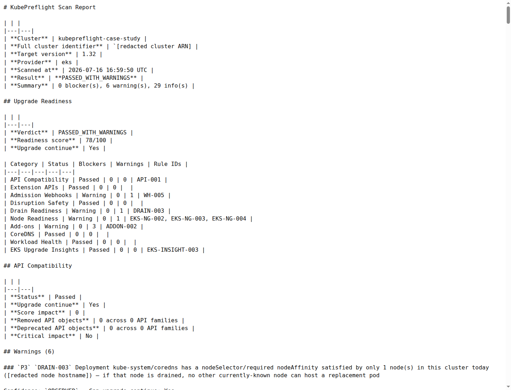
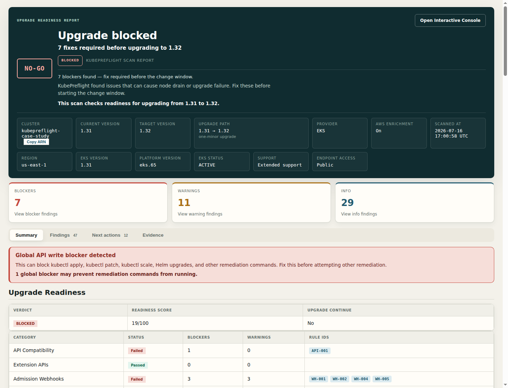
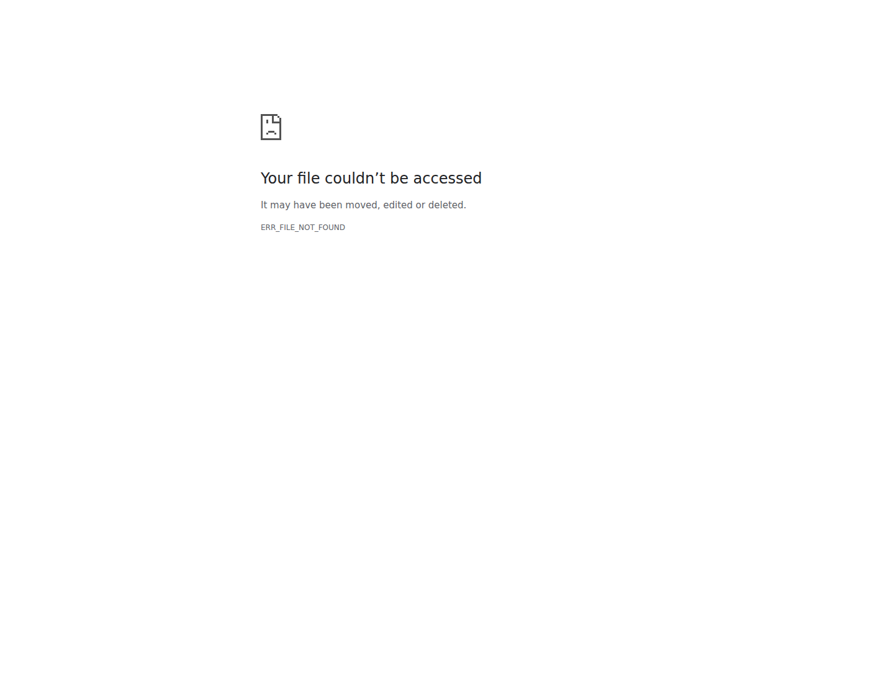
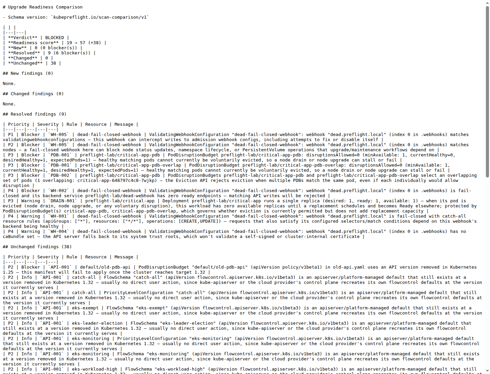
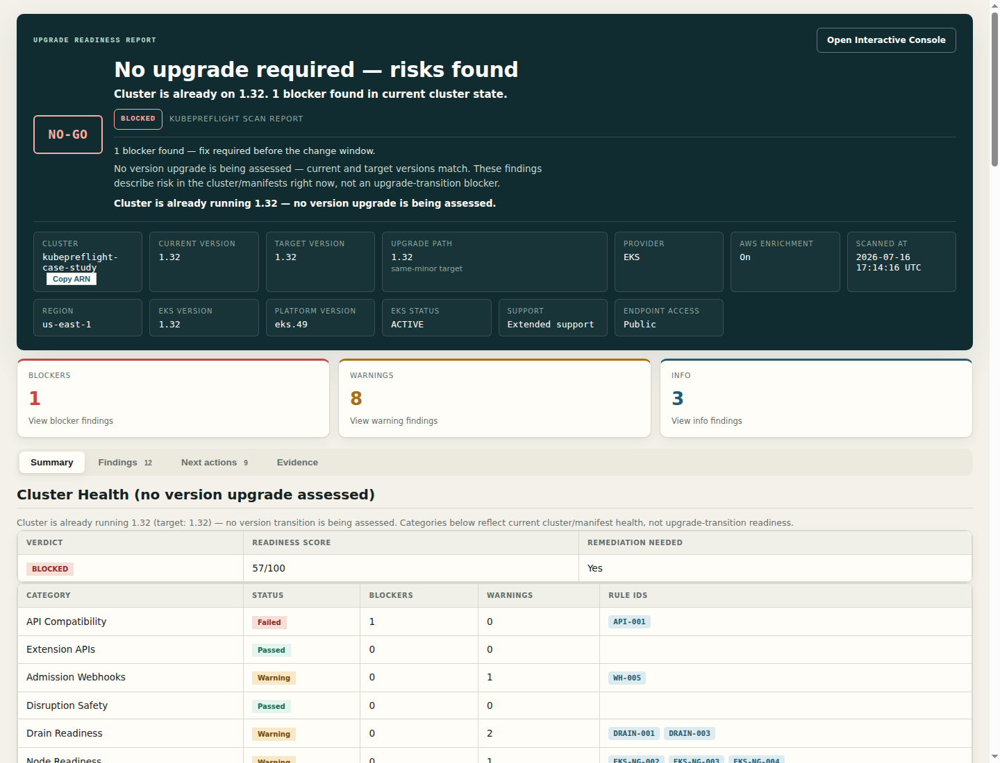
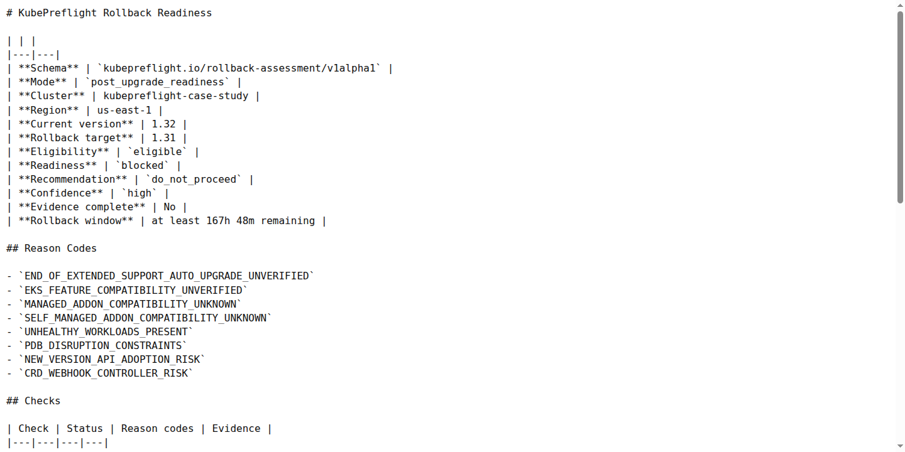
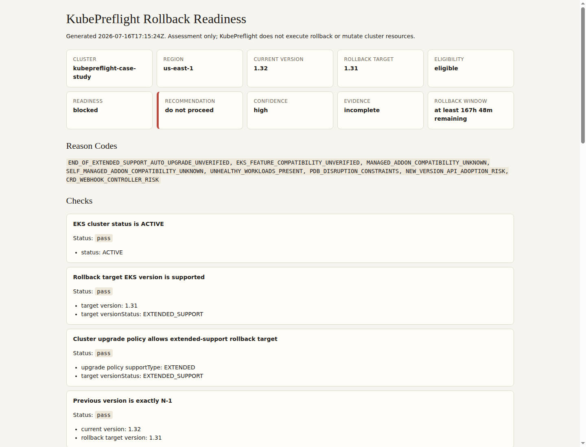
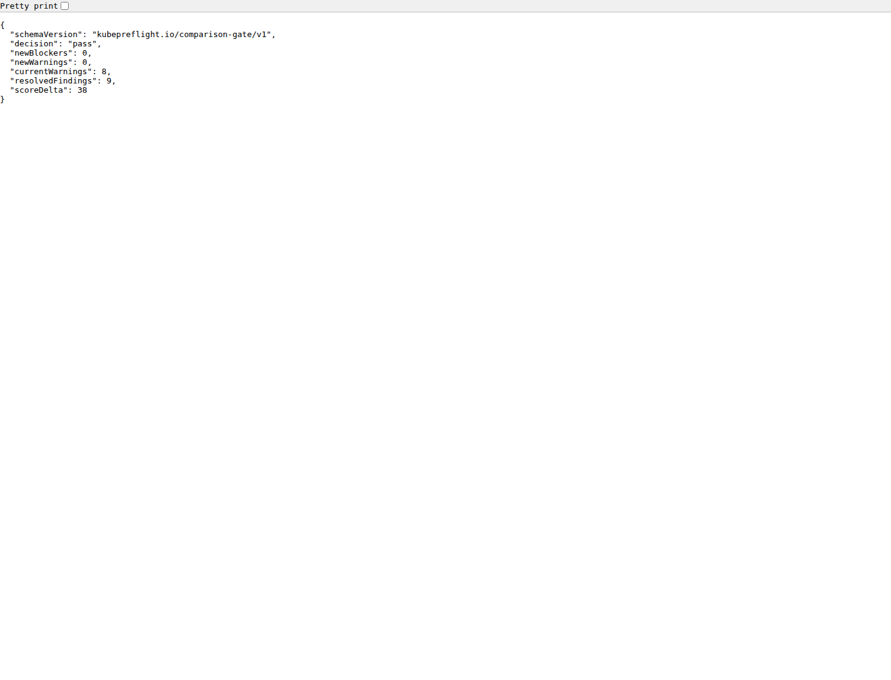

# Real EKS case study: 1.31 to 1.32

Status: **executed**. This case study used one temporary EKS cluster,
`kubepreflight-case-study`, in `us-east-1`; the public evidence is sanitized
and redacts account-specific values. The cluster was created, upgraded from
Kubernetes `1.31` to `1.32`, assessed for rollback readiness, and deleted on
2026-07-16.

This is documentation of a real validation run, not a benchmark and not a
product feature announcement. KubePreflight stayed read-only; rollback was
assessed, not executed.

## 1. Environment

The environment was a deliberately small, disposable EKS cluster defined in
[`demo/eks-case-study/cluster.yaml`](../../demo/eks-case-study/cluster.yaml):
one managed `t3.small` node, one managed node group, no NAT gateway, and
default EKS-managed add-ons. The single-node shape is intentionally minimal,
so several baseline warnings are legitimate warnings about a small lab
cluster rather than seeded failure.

The run reused existing fixtures where possible and added one case-study
workload fixture:

| Risk category | Evidence source | How it was used |
|---|---|---|
| PDB drain risk | [`demo/eks/manifests/pdb-lab.yaml`](../../demo/eks/manifests/pdb-lab.yaml) | Applied live |
| Admission webhook risk | [`demo/eks/manifests/broken-webhook.yaml`](../../demo/eks/manifests/broken-webhook.yaml) | Applied live |
| Deprecated API risk | [`demo/eks/manifests/old-api.yaml`](../../demo/eks/manifests/old-api.yaml) | Manifest-only |
| Unhealthy workload | [`demo/eks-case-study/manifests/unhealthy-workload.yaml`](../../demo/eks-case-study/manifests/unhealthy-workload.yaml) | Applied live |

The deprecated `policy/v1beta1` PodDisruptionBudget fixture was manifest-only
because a Kubernetes 1.31 API server no longer serves that API. That still
models a real upgrade problem: stale YAML in Git, Helm output, or GitOps input
can fail later even if it cannot be applied to the current cluster.

## 2. Initial Baseline

Before fixtures were applied, KubePreflight scanned the clean cluster with
`--provider eks --target-version 1.32`. The real result was
`PASSED_WITH_WARNINGS`, not `CLEAN`: see
[`clean-baseline/findings.json`](../../demo/eks-case-study/evidence/clean-baseline/findings.json)
and [`clean-baseline/report.md`](../../demo/eks-case-study/evidence/clean-baseline/report.md).

The detected fact was 0 blockers, 6 warnings, 29 info findings, and readiness
score `78/100`. The inference is that a one-node EKS cluster can legitimately
warn before any seeded risk exists: CoreDNS had only one schedulable node,
EKS-managed add-on versions lacked catalog entries for target `1.32`, the
managed node group remained a single-node shape, and the EKS
`vpc-resource-validating-webhook` matched node writes at warning priority.

## 3. Seeded Risks

After the fixtures were applied, the scan used live cluster evidence plus the
manifest-only deprecated API file. The result was `BLOCKED`, score `19/100`,
with 7 blockers, 11 warnings, and 29 info findings:
[`before/findings.json`](../../demo/eks-case-study/evidence/before/findings.json)
and [`before/report.md`](../../demo/eks-case-study/evidence/before/report.md).

The blocker set was intentionally controlled:

- `API-001`: the manifest-only `policy/v1beta1` PDB in `old-api.yaml`.
- `PDB-001` and `PDB-002`: no disruption headroom and overlapping PDB risk.
- `WH-002` and `WH-005`: fail-closed webhook behavior that could block
  maintenance writes, including admission webhook configuration writes.

The seeded unhealthy workload remained a warning (`WORKLOAD-001`), which is
useful negative-control evidence: it was real pre-existing breakage, but not
the reason the upgrade gate was blocked.

## 4. Remediation

The remediation script is committed at
[`scripts/case-study/03-remediate.sh`](../../scripts/case-study/03-remediate.sh).
It removed the fail-closed webhook and backend Service first, then scaled the
`critical-app` Deployment to two replicas, then deleted the overlapping PDB.

Those steps intentionally left two risks in place:

- `API-001`, because stale manifest input should keep blocking until source
  YAML is migrated.
- `WORKLOAD-001`, because the broken image fixture was pre-existing workload
  health evidence, not an upgrade-created regression.

## 5. After-Remediation Comparison

After remediation, the scan was still `BLOCKED`, but the score improved to
`57/100` and only the deliberately unresolved `API-001` blocker remained:
[`after-remediation/findings.json`](../../demo/eks-case-study/evidence/after-remediation/findings.json)
and [`after-remediation/report.md`](../../demo/eks-case-study/evidence/after-remediation/report.md).

The before-to-after comparison is committed at
[`compare/resolved-findings/comparison.json`](../../demo/eks-case-study/evidence/compare/resolved-findings/comparison.json),
[`comparison.md`](../../demo/eks-case-study/evidence/compare/resolved-findings/comparison.md),
and [`gate.json`](../../demo/eks-case-study/evidence/compare/resolved-findings/gate.json).
It found 9 resolved findings, 6 resolved blockers, 0 new findings, score
movement `19 -> 57`, and gate decision `pass`.

## 6. EKS 1.31 to 1.32 Upgrade

The EKS control-plane upgrade was run with `eksctl upgrade cluster --approve`.
The captured evidence shows the post-upgrade cluster on Kubernetes `1.32`:
[`after-upgrade/findings.json`](../../demo/eks-case-study/evidence/after-upgrade/findings.json)
and [`after-upgrade/report.md`](../../demo/eks-case-study/evidence/after-upgrade/report.md).

The post-upgrade scan remained `BLOCKED`, score `57/100`, with 1 blocker,
8 warnings, and 3 info findings. That is the expected detected fact: the
control plane was upgraded, but the intentionally unresolved manifest-only
`API-001` risk still existed in source evidence. The managed node group
remaining on Kubernetes `1.31` is supported one-minor skew in this evidence,
not a product bug.

## 7. Rollback Assessment

Rollback readiness was assessed against the real post-upgrade cluster. The
assessment is committed as
[`rollback/rollback-assessment.json`](../../demo/eks-case-study/evidence/rollback/rollback-assessment.json)
and [`rollback/rollback-report.md`](../../demo/eks-case-study/evidence/rollback/rollback-report.md).

The strongest product decision from the run is the separation between platform
eligibility, operational readiness, and recommendation:

| Layer | Result |
|---|---|
| Rollback eligibility | `eligible` |
| Operational readiness | `blocked` |
| Recommendation | `do_not_proceed` |
| Confidence | `high` |

EKS technically allowed rollback, but current operational evidence did not
support proceeding.

That conclusion is not a guess. The rollback assessment had 1 blocker,
4 warnings, and 1 unknown. The hard fail was API/CRD/webhook compatibility,
driven by the still-present `API-001` source finding and webhook-controller
risk. The recommendation is therefore a derived decision layered on top of
detected facts: EKS eligibility was true, but readiness evidence was not good
enough to proceed safely.

## 8. CI Gate Behavior

The comparison gate passed for the remediation comparison because no new
blockers or warnings were introduced and 9 findings were resolved. The gate
evidence is
[`compare/resolved-findings/gate.json`](../../demo/eks-case-study/evidence/compare/resolved-findings/gate.json):
decision `pass`, new blockers `0`, new warnings `0`, current warnings `8`,
resolved findings `9`, score delta `38`.

The post-remediation to post-upgrade comparison is also committed at
[`compare/upgrade-regression/comparison.json`](../../demo/eks-case-study/evidence/compare/upgrade-regression/comparison.json).
It reported gate `pass`, 0 new findings, and 26 resolved info findings. The
detected fact is 26 resolved findings; the interpretation is narrower: those
were upgrade-transition flowcontrol info findings becoming irrelevant once
the cluster was already at target version, not 26 operator-remediated risks.

## 9. Bug Discovered Through Real EKS Validation

The run found one real product bug: six false API blockers on EKS-managed APF
defaults. The affected live objects were EKS-managed
`flowcontrol.apiserver.k8s.io` objects, including `FlowSchema` defaults such
as `eks-exempt`, `eks-leader-election`, `eks-monitoring`, and
`eks-workload-high`, plus the EKS-managed `PriorityLevelConfiguration`
`eks-monitoring`.

Root cause: lifecycle recognition covered the upstream
`apf.kubernetes.io/autoupdate-spec` annotation path, but did not cover the
real EKS-managed `eks-internal` field manager seen on those live
flowcontrol objects. KubePreflight treated them as customer-owned API
migration work and elevated them to blockers.

The fix was deliberately narrow: live flowcontrol auto-managed detection now
recognizes the EKS-managed lifecycle signal for these APF objects. This does
not mean every object touched by `eks-internal` is trusted, nor does it mean
all EKS-managed resources are ignored. The safety boundary is constrained to
the live flowcontrol auto-managed detection path, with regression coverage
for the EKS-managed case and for customer-owned objects that must still be
reported.

Fake or unit-only validation missed this because the relevant signal was not
the Kubernetes API shape alone; it was real EKS `managedFields` ownership on
objects created and reconciled by the provider control plane.

Two case-study tooling bugs were also corrected during execution: the scan
script was narrowed to pass only the manifest-only deprecated API file, and
the remediation script was reordered so the fail-closed webhook was removed
before issuing update operations that it could block.

## 10. Cleanup, Limitations, and Conclusion

Cleanup used [`demo/eks-case-study/cleanup.sh`](../../demo/eks-case-study/cleanup.sh)
after evidence capture. The temporary namespaces, webhook fixture, and EKS
cluster were deleted.

Limitations:

- One temporary single-node EKS environment was used.
- Results are not a universal performance benchmark.
- Rollback was assessed, not executed.
- EKS platform eligibility does not guarantee operational safety.
- Warnings from a minimal cluster can be legitimate.
- Provider-specific rollback behavior currently applies to EKS.

## Result Table

| Stage | Verdict | Score | Important outcome |
|---|---:|---:|---|
| Clean baseline | `PASSED_WITH_WARNINGS` | [`78/100`](../../demo/eks-case-study/evidence/clean-baseline/findings.json) | legitimate single-node warnings |
| Fixtures applied | `BLOCKED` | [`19/100`](../../demo/eks-case-study/evidence/before/findings.json) | controlled risks detected |
| After remediation | `BLOCKED` | [`57/100`](../../demo/eks-case-study/evidence/after-remediation/findings.json) | [`9` findings resolved](../../demo/eks-case-study/evidence/compare/resolved-findings/comparison.json) |
| After upgrade | `BLOCKED` | [`57/100`](../../demo/eks-case-study/evidence/after-upgrade/findings.json) | control plane on `1.32` |
| Rollback assessment | [`eligible`](../../demo/eks-case-study/evidence/rollback/rollback-assessment.json) | — | recommendation `do_not_proceed`, high confidence |

The conclusion is intentionally conservative: KubePreflight correctly showed
progress after remediation, allowed the real EKS control-plane upgrade story
to be inspected with evidence, and still refused to turn platform rollback
eligibility into an operational go-ahead while source and workload risks
remained.
